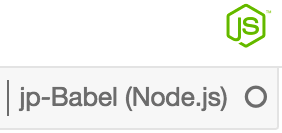

# Machine Learning In Javascript

Materials for the Machine Learning in Javascript Workshop by Expero inc

Given at the [M3 Machine Learning Conference, London, Oct 2017](http://www.mcubed.london/sessions/workshop-introduction-to-machine-learning-with-javascript/)

For an overview of the content see the [course outline](OUTLINE.md)

## Getting Setup

The first part of the course will be run in Jupyter notebooks. Jupyter is a REPL like interface embedded in a web page which is good for experimentation and exploratory development.

It's a standard tool in python for data science. Using it means we install a python distribution even though we are working in javascript. If you are learning ML *some* python is likely in your future anyways so we can maybe live with that.

### Installing python and the notebook kernel

 1. Install an IPython distribution
   - I recomend installing [Anaconda 3.6](https://www.anaconda.com/download/) it is heayweight but that is the distibution I have tested with and if you are interested in moving on apply some of the things you have learnt after the conference in python too, then this is a good starting point.
 2. Install [node.js](https://nodejs.org/en/) we are using v8.5.x.
   - If you already have node installed and don't want ot mess with your local environement install `nvm` and install node v8.5.x from there. 
     - on Mac [nvm](https://github.com/creationix/nvm/blob/master/README.md)
     - on Windows [nvm-windows](https://github.com/coreybutler/nvm-windows)
 3. Install the `jp-babel` variant of the IJavascript kernel
    - `npm install -g jp-babel`
    - if you are running on linux check out the instructions on [this page](http://n-riesco.github.io/ijavascript/doc/install.md.html)
 4. Install Javascript dependencies
   - run `npm install` in the repo root folder :)
 5. Start the notebook
   - run `jp-babel-notebook` in the repo root folder
   - a web browser should pop up showing the Jupyter browser / tree view of the current folder.
 6. From Jupyter, open the [smoke test notebook](0_smoke_test.ipynb)
   - When the notebook opens you should be able to see the `jp-babel` javascript kernel loaded in the top left corner.

     

   - If not, go to `Kernel Menu` > `Change Kernel` and select the `jp-babel` option and follow the prompts.
   - In the `Cell Menu`, select `Run All`. Each cell should execute and if all dependencies are properly installed we shouldn't see any errors.

### Setting up to run Keras.js models in the browser
...